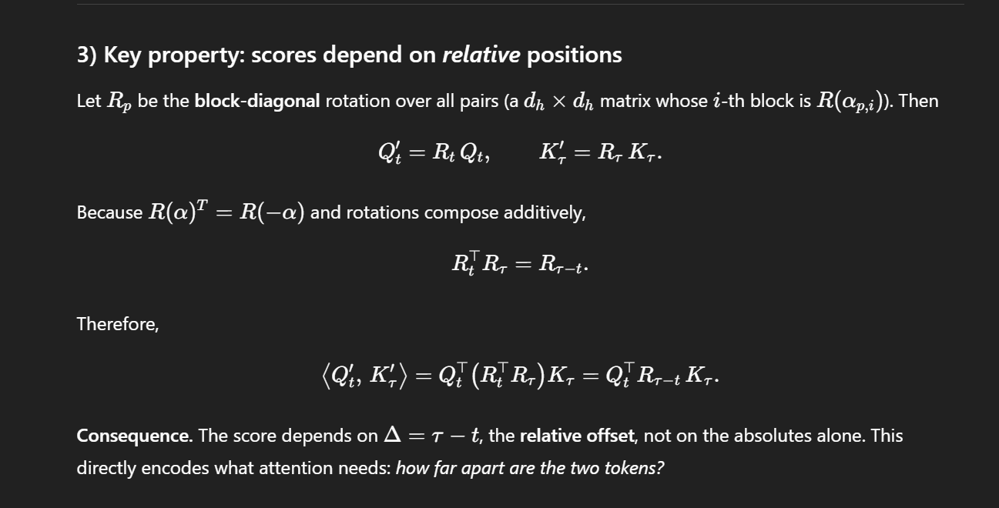
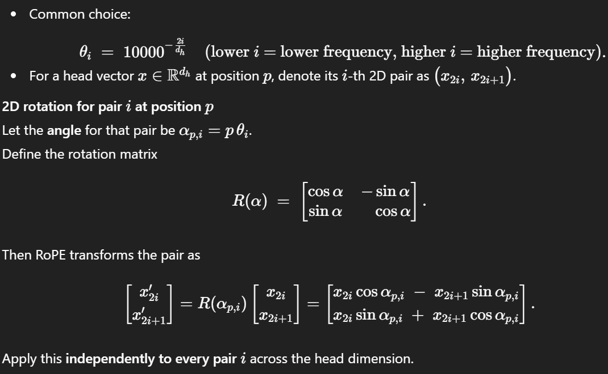

# Whisper : A primer for speech recognitions

## Architecture
### High level 
A whisper model is an AED (Autoregressive Encoder Decoder) architecture. 

#### Encoder
a. convolution
Inputs : (B, num_mel_bins, T) # log melspectogram
d_model = 768
Convolution 1 = `nn.Conv1d(num_mel_bins, d_models, kernel_size=k, stride=s, padding=k // 2 )`
Convolution 2 = `nn.Conv1d(d_models, d_models, kernel_size=k, stride=s, padding=k // 2 )`

Convolution operation transform (B, num_mel_bins, T) to (B, D, T') where D is the d_model and T' is the downsampled temporal axis. Remember that conv1d moves in the direction of the last axis, creating T to T'.

b. Positional embeddings
## important differences
Original whisper used learned position embedding.
Modern LLM use fixed rope position embedding
(Whisper maintainers confirm: sinusoidal in encoder, learned in decoder.)
x = x.transpose(1, 2)  # (B, T', D)

`self.pos_embed = nn.Embedding(1 + (config.max_source_positions // config.subsampling_factor), D)`

`pos_ids = torch.arange(src_len, device=x.device).clamp_max(self.pos_embed.num_embeddings - 1)`

`x = x + self.pos_embed(pos_ids)[None, :, :]`

`x = self.dropout(x)`

Intuition
1. we want to get attention to attend to local tokens more than far away tokens in attentions.

2. We can do it by V = Q R_(T-\tau) K where R is the scaling vectors

1. We basically want something that has this property
R (\alpha)^ T (rotate 90 degree) = R (-\alpha)
So we can have 
R_(T-\tau) = R_T x R_(tau) where R is between -1 and 1.

1. The way to do it is

c. downsample_attention_mask
